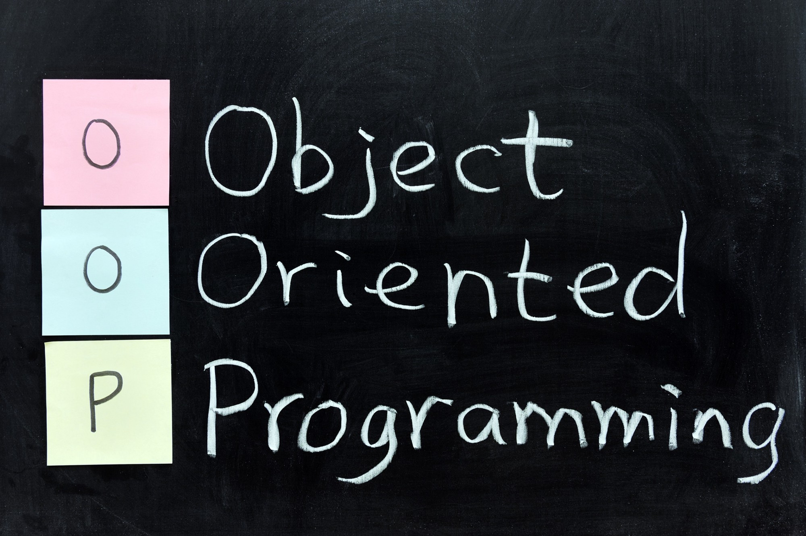
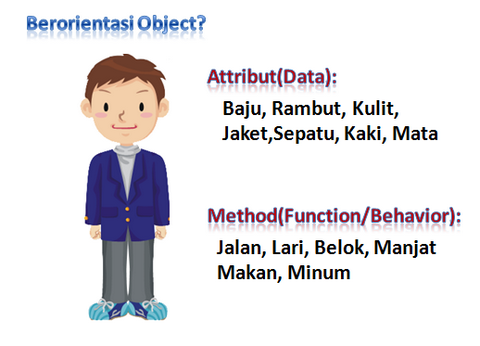
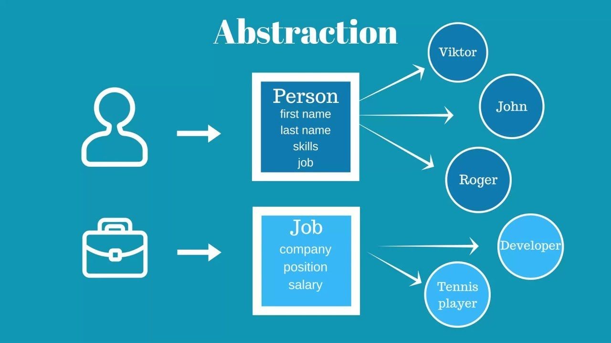
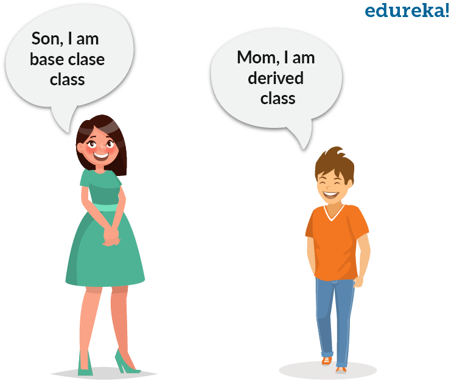
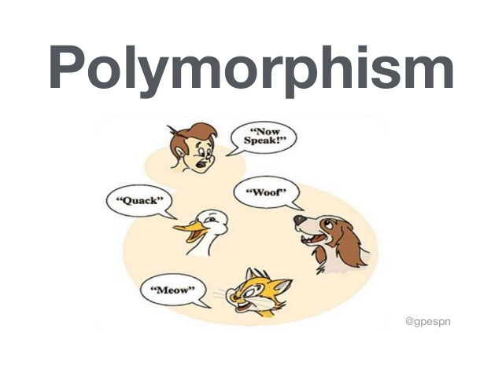

# PBO - Pertemuan 1
# Identifikasi Pemrograman Berorientasi Objek

## Keywrods
<table>
<tr>
    <td>Abstraksi</td>      <td>Java</td>
</tr>
<tr>
    <td>Konsep</td>         <td>OOP</td>
</tr>
<tr>
    <td>Pembungkusan</td>   <td>Pewarisan</td>
</tr>
<tr>
    <td>Polimorfisme</td>   <td>Prosedur</td>
</tr>
</table>

## 1. Konsep Pemrograman Berorientasi Objek
>Pemrograman berorientasi objek (*Object Oriented Programming/OOP*) adalah paradigma pemrograman berdasarkan konsep "objek", yang mungkin berisi data, dalam bentuk bidang, sering dikenal sebagai atribut; dan kode, dalam bentuk prosedur, yang sering disebut sebagai metode. Misalnya, seseorang adalah suatu objek yang memiliki sifat tertentu seperti tinggi, jenis kelamin, usia, dll. Ia juga memiliki metode tertentu seperti bergerak, berbicara, dan sebagainya.
 
>Beberapa ciri dan konsep dalam OOP/PBO adalah abtraksi(*abstraction*), pembungkusan (*encapsulation*), pewarisan (*inheritance*), dan polimorfisme (*polymorphism*).

>

### a. *Abstraction*
>
>
>Ini mengacu pada, hanya memberikan informasi penting ke dunia luar dan menyembunyikan detail latar belakang mereka. Misalnya, server web menyembunyikan cara memproses data yang diterimanya, pengguna akhir hanya mencapai titik akhir dan mendapatkan data kembali.

### b. *Encapsulation*
>
>
>Enkapsulasi adalah proses pengikatan anggota data (variabel, properti) dan fungsi anggota (metode) menjadi satu kesatuan. Ini juga merupakan cara untuk membatasi akses ke properti atau komponen tertentu. Contoh terbaik untuk enkapsulasi adalah kelas.

### c. *Inheritance*
>
>
>Kemampuan untuk membuat kelas baru dari kelas yang sudah ada disebut Inheritance. Dengan menggunakan pewarisan, kita dapat membuat kelas Anak dari kelas Induk sedemikian rupa sehingga mewarisi properti dan metode dari kelas induk dan dapat memiliki properti dan metode tambahannya sendiri. Sebagai contoh, jika kita memiliki kelas Kendaraan yang memiliki properti seperti Warna, Harga, dll, kita dapat membuat 2 kelas seperti Sepeda dan Mobil darinya yang memiliki 2 properti tersebut dan properti tambahan yang dikhususkan untuk mereka seperti mobil memiliki numberOfWindows/jumlahJendela sedangkan sepeda tidak bisa. Hal yang sama berlaku untuk metode.

### d. *Polymorphism*
>
>Kata polimorfisme berarti memiliki banyak bentuk. Biasanya, polimorfisme terjadi ketika ada hierarki kelas dan mereka terkait dengan pewarisan. Polimorfisme C++ berarti bahwa panggilan ke fungsi anggota akan menyebabkan fungsi yang berbeda dieksekusi tergantung pada jenis objek yang memanggil fungsi tersebut.

## Prosedur Pemrograman Berorientasi Objek
>
>
>Ada beberapa bahasa pemrograman yang mendukung OOP/PBO, salah satunya adalah Java yang diciptakan oleh James Gosling, seorang developer dari Sun Microsystems. Perkembangan java tidak hanya berfokus pada satu system operasi tapi juga dikembangkan untuk berbagai system operasi dan bersifat opensource. Java muncul dari sebuah project yang dinamakan “The Green Project”, yang sudah berjalan selama 18 bulan dari awal tahun 1991 hingga musim panas 1992. 
>Project ini dimotori oleh Patrick Naughton,Mike Sheridan, James Gosling dan Bill Joy, beserta Sembilan programmer lainnya dari Sun Microsystems. Dan pada musim panas 1992 project ini ditutup dengan menghasilkan sebuah program Java Oak pertama.
>
>Pada bulan Maret tahun 1995, untuk pertama kalinya, source code java versi 1.0a2 dirilis
>
>Pada 23 Januri tahun 1996 Versi awal Java (JDK 1.0) dirilis. Java versi ini telah menyertakan banyak paket standar awal yang terus dikembangkan pada versi selanjutnya:

>>* java.lang   : Peruntukan untuk kelas elemen-elemen dasar.
>>* java.io     : Peruntukan untuk kelas input dan output, dan termasuk penggunaan berkas.
>>* java.util   : Diperuntukan kelas pelengkap seperti kelas struktur data dan kelas kelas penanggalan.
>>* java.net    : Diperuntukan kelas TCP/IP, yang memungkinkan berkomunikasi dengan komputer lain menggunakan jaringan TCP/IP.
>>* java.awt    : Kelas dasar untuk sebuah aplikasi antarmuka dengan pengguna (GUI)
>>* java.applet : Kelas dasar aplikasi antar muka untuk diterapkan di penjelajah web.
