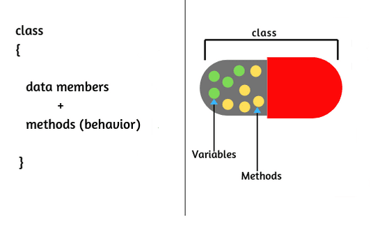

# PBO - Pertemuan 1
# Identifikasi Pemrograman Berorientasi Objek

## Keywrods
<table>
<tr>
    <td>Abstraksi</td>      <td>Java</td>
</tr>
<tr>
    <td>Konsep</td>         <td>OOP</td>
</tr>
<tr>
    <td>Pembungkusan</td>   <td>Pewarisan</td>
</tr>
<tr>
    <td>Polimorfisme</td>   <td>Prosedur</td>
</tr>
</table>

## 1. Konsep Pemrograman Berorientasi Objek
>Pemrograman berorientasi objek (*Object Oriented Programming/OOP*) adalah paradigma pemrograman berdasarkan konsep "objek", yang mungkin berisi data, dalam bentuk bidang, sering dikenal sebagai atribut; dan kode, dalam bentuk prosedur, yang sering disebut sebagai metode. Misalnya, seseorang adalah suatu objek yang memiliki sifat tertentu seperti tinggi, jenis kelamin, usia, dll. Ia juga memiliki metode tertentu seperti bergerak, berbicara, dan sebagainya.
 
>Beberapa ciri dan konsep dalam OOP/PBO adalah abtraksi(*abstraction*), pembungkusan (*encapsulation*), pewarisan (*inheritance*), dan polimorfisme (*polymorphism*).

>

### a. *Abstraction*
>
>
>Ini mengacu pada, hanya memberikan informasi penting ke dunia luar dan menyembunyikan detail latar belakang mereka. Misalnya, server web menyembunyikan cara memproses data yang diterimanya, pengguna akhir hanya mencapai titik akhir dan mendapatkan data kembali.

### b. *Encapsulation*
>
>
>Enkapsulasi adalah proses pengikatan anggota data (variabel, properti) dan fungsi anggota (metode) menjadi satu kesatuan. Ini juga merupakan cara untuk membatasi akses ke properti atau komponen tertentu. Contoh terbaik untuk enkapsulasi adalah kelas.

### c. *Inheritance*
>
>
>Kemampuan untuk membuat kelas baru dari kelas yang sudah ada disebut Inheritance. Dengan menggunakan pewarisan, kita dapat membuat kelas Anak dari kelas Induk sedemikian rupa sehingga mewarisi properti dan metode dari kelas induk dan dapat memiliki properti dan metode tambahannya sendiri. Sebagai contoh, jika kita memiliki kelas Kendaraan yang memiliki properti seperti Warna, Harga, dll, kita dapat membuat 2 kelas seperti Sepeda dan Mobil darinya yang memiliki 2 properti tersebut dan properti tambahan yang dikhususkan untuk mereka seperti mobil memiliki numberOfWindows/jumlahJendela sedangkan sepeda tidak bisa. Hal yang sama berlaku untuk metode.

### d. *Polymorphism*
>
>Kata polimorfisme berarti memiliki banyak bentuk. Biasanya, polimorfisme terjadi ketika ada hierarki kelas dan mereka terkait dengan pewarisan. Polimorfisme C++ berarti bahwa panggilan ke fungsi anggota akan menyebabkan fungsi yang berbeda dieksekusi tergantung pada jenis objek yang memanggil fungsi tersebut.

## Prosedur Pemrograman Berorientasi Objek
>
>
>Ada beberapa bahasa pemrograman yang mendukung OOP/PBO, salah satunya adalah Java yang diciptakan oleh James Gosling, seorang developer dari Sun Microsystems. Perkembangan java tidak hanya berfokus pada satu system operasi tapi juga dikembangkan untuk berbagai system operasi dan bersifat opensource. Java muncul dari sebuah project yang dinamakan “The Green Project”, yang sudah berjalan selama 18 bulan dari awal tahun 1991 hingga musim panas 1992. 
>Project ini dimotori oleh Patrick Naughton,Mike Sheridan, James Gosling dan Bill Joy, beserta Sembilan programmer lainnya dari Sun Microsystems. Dan pada musim panas 1992 project ini ditutup dengan menghasilkan sebuah program Java Oak pertama.
>
>Pada bulan Maret tahun 1995, untuk pertama kalinya, source code java versi 1.0a2 dirilis
>
>Pada 23 Januri tahun 1996 Versi awal Java (JDK 1.0) dirilis. Java versi ini telah menyertakan banyak paket standar awal yang terus dikembangkan pada versi selanjutnya:

>>* java.lang   : Peruntukan untuk kelas elemen-elemen dasar.
>>* java.io     : Peruntukan untuk kelas input dan output, dan termasuk penggunaan berkas.
>>* java.util   : Diperuntukan kelas pelengkap seperti kelas struktur data dan kelas kelas penanggalan.
>>* java.net    : Diperuntukan kelas TCP/IP, yang memungkinkan berkomunikasi dengan komputer lain menggunakan jaringan TCP/IP.
>>* java.awt    : Kelas dasar untuk sebuah aplikasi antarmuka dengan pengguna (GUI)
>>* java.applet : Kelas dasar aplikasi antar muka untuk diterapkan di penjelajah web.

## Keunggulan Pemrograman Berorientasi Objek terhadap Pemrograman Struktural/Prosedural
Salah satu bahasa pemrograman dengan orientasi objek yang populer adalah Java. Bahasa Pemrograman ini menjadi populer karena kemudahan dalam penggunaannya. Java termasuk bahasa pemrograman yang bersifat umum/non spesifik (general purpose), dan secara khusus di desain untuk memanfaatkan dependensi implementasi seminimal mungkin.

### a. Kelebihan PBO
>1. Pada penggunaan sebuah *class* hanya perlu ditulis sekali
>2. Penambahan fitur pada *class* tanpa mengubah *class* semula
>3. Penggunaan *object* tanpa harus mengerti teknis yang ada didalamnya
>4. Data yang digunakan dalam bentuk *private* hanya dapat diakses oleh fungsi lokasi. Jadi, tidak perlu khawatir untuk memengaruhi fungsi lainnya
>5. *Library* Java makin bertambah karena meningkatnya pengembangan aplikasi sehingga *library* juga ikut meningkat. Hal tersebut memudahkan *programmer* dalam membangun sebuah aplikasi. Selain itu, tampilannya juga cukup rapi.
>6. Memiliki sintaks. Contoh : bahasa C dan C++
>7. Memiliki pengaturan memori secara langsung

### b. Pengembangan Terintegrasi
>IDE (Integrated Development Environment) adalah program komputer sebagai lingkungan pengembangan aplikasi atau program komputer yang mempunyai beberapa fasilitas yang dibutuhkan dalam pembangunan perangkat lunak (Software).
>Tujuan dari IDE yaitu untuk menyediakan semua utilitas yang dibutuhkan untuk membangun perangkat lunak. Menjadi seorang programmer diharuskan untuk mengetahui berbagai Integrated Development Environment untuk pembangunan perangkat lunak.
>
>Lingkungan Pengembangan Terpadu, setidaknya memiliki fasilitas seperti :
>
>- Editor, fasilitas ini diperuntukan menuliskan kode atau fungsi-fungsi yang bisa diterjemahkan oleh mesin komputer >- sebagai kode programming.
>- Compiler, Berfungsi untuk menjalankan bentuk kode program yang di tuliskan di Editor dan mengubah dalam bentuk binary yang selanjutnya akan ditampilkan sesuai perintah-perintah kode mesin.
>- Debuger, Berguna untuk mengecek dan juga mengetes jalannya kode program untuk mencari atau mendebug kesalahan dari program.
>- Frame/Views, fasilitias yang satu ini berguna untuk menujukan atau menampilkan hasil dari perintah-perintah kode program yang dieksekusikan oleh Compiler dari Editor.
>
>Beberapa contoh Java IDE yang populer : IntelliJ IDEA, NetBeans, Dr. Java, Eclipse, BlueJ, Oracle JDeveloper, dsb.

### c. Kelebihan program Java
>- *Multiplatform*
>>Sesuai dengan prinsip "Tulis sekali, jalankan dimana saja". Java dapat dijalankan diberbagai Sistem Operasi, seperti Microsoft Windows, Linux, MacOS, dan Sun Solaris. Hal ini disebabkan karena setiap Sistem Operasi menggunakan programnya masing-masing (yang dapat diunduh dari situs Java) untuk menginterpretasikan *bytecode* tersebut.
>- *Class Librabry*/Perpustakaan Class
>>Java terkenal dengan kelengkapan *library* yang memudahkan dalam penggunaannya oleh para *programmer* untuk membangun aplikasinya. Kelengkapannya ditambah dengan keberadaan komunitas Java yang terus-menerus membuat perpustakaan-perpustakaan baru untuk melingkupi seluruh kebutuhan pengembangan aplikasi.
>- Bergaya C++
>>*Sysntax* yang dimiliki oleh Java tidak jauh berbeda dengan bahasa C++. Hal ini dikarenakan Java dikembangkan berdasarkan bahasa C dan C++.
>- Pengumpulan Sampah Otomatis
>>Memiliki fasilitas pengaturan penggunaan memori sehingga para *programmer* tidak perlu melakukan pengaturan memori secara langsung (seperti halnya bahasa C++ yang dipakai secara luas).

### d. Kekurangan Program Java
>- Tulis sekali, jalankan di mana saja
>>Ada beberapa faktor yang menyebabkan hal ini terkendala dikarenakan kompabilitas antara satu *platform* dengan *platform* lainnya. Contohnya J2SE, sampai saat ini SWT-AWT *bridge* tidak dapat berfungsi pada MacOS X
>- Mudah didekompilasi
>>Dekompilasi merupakan proses pengembalian/pembalikan kode yang sudah jadi menjadi kode sumber. Hal ini dimungkinkan karena kode jadi Java merupakan *bytecode* yang menyimpan banyak atribut bahasa tingkat tinggi, seperti nama-nama *class*, *method*, dan tipe data. Sehingga algoritma yang digunakan program akan lebih sulit untuk disembunyikan dan mudah dibajak/*reverse engineering*
>- Penggunaan memori yang banyak
>>Penggunaan memori untuk program berbasi Java jauh lebih besar daripada bahasa tingkat tinggi generasi sebelumnya, seperti C/C++, Pascal, Delphi, dan Object Pascal. Umumnya, bukan masalah bagi pihak yang menggunakan teknologi terbaru.